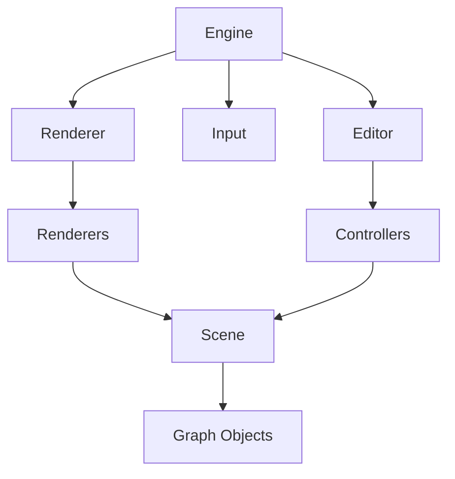
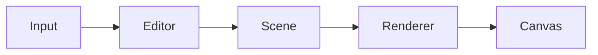
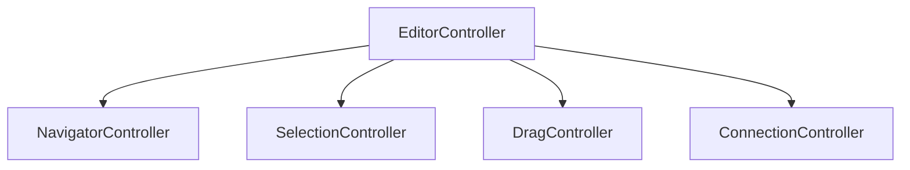

# Phantom Graph Architecture

## Lois de Phantom Graph

### Loi 1 - Une responsabilité par classe  
### Lois 2 - Une responsabilité par fichier
### Loi 3 - Les données ignorent l'affichage
### Loi 4 - Les renderers ne modifient jamais les données
### Loi 5 - Les contrôleurs sont les seuls à modifier la scène
### Loi 6 - Une seule source de vérité
### Loi 7 - Les conversions de coordonnées passent uniquement par la caméra
### Loi 8 - L'Engine orchestre, il ne réfléchit pas
### Loi 9 - Tout doit être personnalisable
### Loi 10 - Les fondations avant les fonctionnalités

## Vision

Phantom Graph est un éditeur de graphes moderne inspiré de Mermaid,  
Le projet repose sur trois principes fondamentaux :  

- Une responsablité par classe.
- Une architecture modulaire.
- Une séparation stricte entre les données, l'affichage et les interactions.  

---  

---  
# Les grands systèmes

## Engine

Le moteur principal.  

Responsabilités :  

- initialisation
- boucle principale
- coordination des systèmes

Il ne contient aucune logique métier.

---

## Renderer

Dessine la scène.  
Il ne modifie jamais les objects.

---

## Scene

Contient les coordonnées.  
Elle ne dessine jamais.

---

## Input

Capture uniquement les entrées utilisateur.  
Il ne prend aucune décision.

---

## Editor

Transforme les entrées utilisateur en actions.  

Exemples :
- navigation
- sélection
- déplacement
- création
- suppression

---

# Les objets

Les objets représentent uniquement les données.

Exemple :
- position
- taille
- titre
- ports

Aucun code de rendu.

---

# Les renderers

Chaque renderer dessine une seule chose.

Exemple : 
- `BackgroundRenderer` -> dessine uniquement le fond.  
- `GridRenderer` -> dessine uniquement la grille.
- `NodeRenderer` -> dessine uniquement les nodes.

---

# Les controllers

Chaque controller gère une interaction.

- `NavigationController` -> caméra
- `SelectionController` -> sélection
- `DragController` -> déplacement
- `ConnectionController` -> création des liens
- `KeyboardController` -> raccourcis clavier

---

# Dépendances

Les dépendances autorisées :

- `Engine` -> `Renderer` `Input` `Editor` `Scene` `Camera`
- `Renderer` -> `Scene` `Camera`
- `Editor` -> `Input` `Camera` `Scene`

Les dépendances interdites :

- `Node` -> `Renderer`
- `Renderer` -> `Mouse`
- `Mouse` -> `Camera`
- `GraphObject` -> `Renderer`
- `Renderer` -> `Input`

---

# Philosophie

Le code doit toujours être :

- simple
- lisible
- modulaire
- extensible

Une class doit avoir une seule responsabilité.  
Un fichier doit contenir une seule classe.  
Les interactions utilisateur doivent être séparées.  
Les données ne jamais connaître leur représentation graphique.

# Graph
## Flux d'une frame

## Contrôleurs
