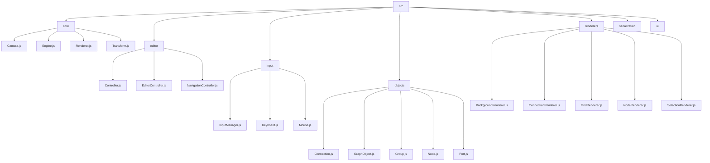

```mermaid
flowchart TD
    src
    src --> core
    src ---> editor
    src ----> input
    src -----> objects
    src --> renderers
    src --> serialization
    src --> ui

    core --> core1[Camera.js]
    core --> core2[Engine.js]
    core --> core3[Renderer.js]
    core --> core4[Transform.js]

    editor ---> editor1[Controller.js]
    editor ---> editor2[EditorController.js]
    editor ---> editor3[NavigationController.js]

    input ----> input1[InputManager.js]
    input ----> input2[Keyboard.js]
    input ----> input3[Mouse.js]

    objects -----> objects1[Connection.js]
    objects -----> objects2[GraphObject.js]
    objects -----> objects3[Group.js]
    objects -----> objects4[Node.js]
    objects -----> objects5[Port.js]

    renderers -----> r1[BackgroundRenderer.js]
    renderers -----> r2[ConnectionRenderer.js]
    renderers -----> r3[GridRenderer.js]
    renderers -----> r4[NodeRenderer.js]
    renderers -----> r5[SelectionRenderer.js]
```