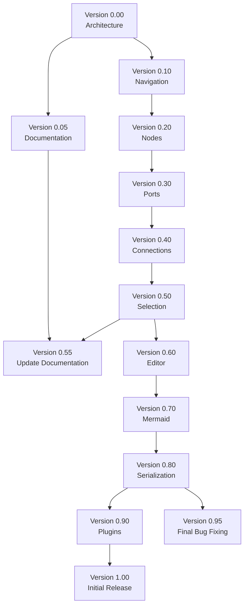

```mermaid
flowchart TD
    v0_00["Version 0.00<br>Architecture"]
    v0_05["Version 0.05<br>Documentation"]
    v0_10["Version 0.10<br>Navigation"]
    v0_20["Version 0.20<br>Nodes"]
    v0_30["Version 0.30<br>Ports"]
    v0_40["Version 0.40<br>Connections"]
    v0_50["Version 0.50<br>Selection"]
    v0_55["Version 0.55<br>Update Documentation"]
    v0_60["Version 0.60<br>Editor"]
    v0_70["Version 0.70<br>Mermaid"]
    v0_80["Version 0.80<br>Serialization"]
    v0_90["Version 0.90<br>Plugins"]
    v0_95["Version 0.95<br>Final Bug Fixing"]
    v1_00["Version 1.00<br>Initial Release"]

    v0_00 --> v0_10 & v0_05
    v0_05 -----> v0_55
    v0_10 --> v0_20
    v0_20 --> v0_30
    v0_30 --> v0_40
    v0_40 --> v0_50
    v0_50 --> v0_60 & v0_55
    v0_60 --> v0_70
    v0_70 --> v0_80
    v0_80 --> v0_90 & v0_95
    v0_90 --> v1_00
```